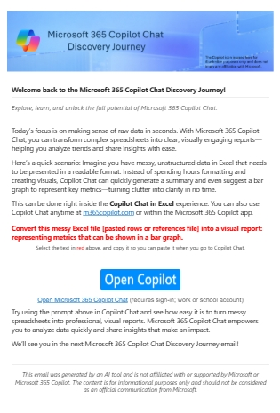
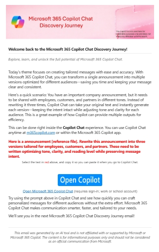

# Copilot Adoption Agent

The **Copilot Adoption Agent** is a packaged Copilot Studio solution that helps organizations launch structured adoption campaigns for **Copilot Chat** and **Microsoft 365 Copilot**.

Version **2.1.0.1** builds on the original campaign agent by packaging the experience into a cleaner solution with guided campaign setup, product-specific enablement content, and automated delivery flows for Beginner, Intermediate, and Advanced audiences.

## What it does

- Creates a four-week Copilot adoption email campaign.
- Sends three emails per week for four weeks, for a total of 12 campaign messages.
- Supports three audience levels: **Beginner**, **Intermediate**, and **Advanced**.
- Supports two campaign tracks: **Copilot Chat** and **Microsoft 365 Copilot**.
- Sends messages from the authenticated Outlook mailbox connected during setup.
- Includes a test mode so admins can validate the full campaign sequence using a minute-based delay before launching production.
- Includes enablement guide knowledge sources so the agent can answer adoption, onboarding, and skilling questions.

## Included package

Download and import the solution package:

**`CopilotAdoptionAgent_2_1_0_1.zip`**

Do **not** extract this solution zip before importing it into Power Platform or Copilot Studio.

The solution includes:

| Component | Purpose |
| --- | --- |
| Copilot Studio agent | Conversational setup experience for configuring and starting campaigns. |
| Adoption Email Scheduler topic | Collects campaign type, audience level, target recipients, timezone, and test or production settings. |
| Six agent-triggered cloud flows | One flow for each product and skill-level combination. |
| Enablement guide knowledge sources | Product-specific guidance for Copilot Chat and Microsoft 365 Copilot. |
| Outlook connector reference | Sends campaign messages from the authenticated sender mailbox. |

## Campaign tracks

| Product | Beginner | Intermediate | Advanced |
| --- | --- | --- | --- |
| Copilot Chat | Included | Included | Included |
| Microsoft 365 Copilot | Included | Included | Included |

Each campaign runs independently, so multiple campaigns can be configured for different audiences or skill levels.

## Delivery schedule

Production campaigns send email on:

- Tuesday at 10:00 AM
- Wednesday at 10:00 AM
- Thursday at 10:00 AM

The scheduler uses the timezone selected during campaign setup. Test campaigns use the delay value entered by the admin so the full sequence can be reviewed without waiting for the production cadence.

## Prerequisites

Before importing the solution, make sure you have:

- A Microsoft 365 tenant with Copilot Studio and Power Platform access.
- A Dataverse environment where the solution can be imported.
- Permission to import solutions and configure connection references.
- An Outlook mailbox that can send to the intended users or distribution lists.
- Permission to send to the selected distribution list or recipient group.

Recommended admin roles include one of the following:

- Environment Admin
- System Administrator
- Copilot Studio Administrator
- Power Platform Administrator

## Import instructions

1. Download this repository or download the solution package directly.
2. Locate **`CopilotAdoptionAgent_2_1_0_1.zip`**.
3. Open [Copilot Studio](https://copilotstudio.microsoft.com) and select the target environment.
4. Go to **Solutions**.
5. Select **Import solution**.
6. Upload **`CopilotAdoptionAgent_2_1_0_1.zip`**.
7. In the import wizard, expand **Advanced settings**.
8. Clear **Enable all workflows and connections included in the solution**.
9. Complete the import.

Clearing the workflow auto-enable option is important. It prevents flows from running before the Outlook connection reference has been reviewed and authenticated.

## Configure the Outlook connection

After import:

1. Open the **Copilot Adoption Agent** solution.
2. Select **Connection references**.
3. Locate the Outlook connection reference.
4. Confirm it is connected to the mailbox that should send campaign emails.
5. Reconnect or update the connection if needed.

Campaign emails are sent from this authenticated mailbox.

## Start a campaign

Open the Copilot Adoption Agent and use:

```text
start email scheduler
```

The agent will guide you through:

1. Choosing **Test** or **Production**.
2. Selecting **Copilot Chat** or **Microsoft 365 Copilot**.
3. Selecting **Beginner**, **Intermediate**, or **Advanced**.
4. Entering the recipient email address or distribution list.
5. Selecting the timezone.
6. Confirming the campaign details.

For test runs, the agent also asks for the delay in minutes between emails.

## Recommended validation flow

Before sending to a broad audience:

1. Start a **Test** campaign.
2. Send it to yourself or a small validation group.
3. Review formatting, links, timing, and sender behavior.
4. Confirm the distribution list accepts messages from the connected mailbox.
5. Start the **Production** campaign only after the test sequence is validated.

## Customization

This is an unmanaged solution, so admins can tailor it for their organization. Common customizations include:

- Updating email copy or branding in the flows.
- Adjusting the production cadence.
- Adding organization-specific links, learning paths, or internal resources.
- Extending the agent instructions or knowledge sources.
- Creating additional tracks for specific personas or business groups.

## Screenshots

Example campaign email previews:





## Troubleshooting

If emails do not send:

- Confirm the Outlook connection reference is connected.
- Confirm the sender mailbox can send to the target recipients or distribution list.
- Check the flow run history for the selected product and skill level.
- Verify the recipient entry uses a valid email address or distribution list.
- For multiple individual recipients, separate addresses with semicolons.
- Run a test campaign first to isolate formatting, connection, or routing issues.

## Notes

- The agent is intended for Copilot adoption communications and enablement guidance.
- It does not assign licenses, provision users, or manage tenant configuration.
- Production campaigns run in the background after the selected flow starts.
- The solution can be customized after import to align with local branding and adoption strategy.

## Disclaimer

This project is independently developed and is not affiliated with, endorsed by, or supported by Microsoft. Microsoft product names are used for identification and informational purposes only.
